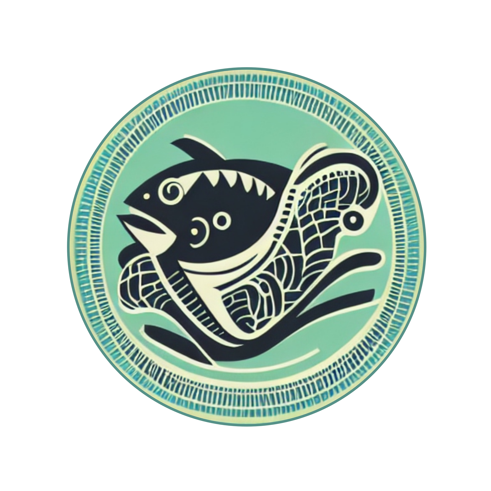

# <span style="color:green">__Capstone Project__

# <span style="color:navy">__>> fish fish facts! <<__

🐟🐟🐟🐟🐟🐟🐟🐟🐟🐟🐟🐟🐟🐟🐟🐟🐟🐟🐟🐟🐟🐟🐟🐟🐟🐟🐟🐟🐟🐟🐟🐟🐟

 
.

### **The Project:** 

Dive in to fish out the facts! 

A classification app for your holiday snapshots or your greatest catch. Raising awareness for species conservation. 

Upload your fish image and use our Streamlit App, developed using Convolutional Neural Network & Transfer Learning. With this app you will find out all of the facts about your fish.

.
### **Source of the data:** 

[Kaggle Dataset](https://www.kaggle.com/datasets/sripaadsrinivasan/fish-species-image-data) owned by Sripaad Srinivasan.
This fish species dataset, currently consisting of 3,960 images collected from 468 species, contains real-world images of fish captured in 3 conditions defined as

1. "controlled", 
2. "out-of-the-water" and 
3. "in-situ".

The "controlled", images consists of fish specimens, with their fins spread, taken against a constant background with controlled illumination.

The "in-situ" images are underwater images of fish in their natural habitat and so there is no control over background or illumination.

The "out-of-the-water" images consist of fish specimens, taken out of the water with a varying background and limited control over the illumination conditions.

.
### **Team:** 

- Erik Gebel: [GitHub](https://github.com/edierik) & [LinkedIn](https://www.linkedin.com/in/erik-gebel/)
- Karine Real: [GitHub](https://github.com/kaqreal) & [LinkedIn](https://www.linkedin.com/in/kaqreal/)
- Niels Lory: [GitHub](https://github.com/niels-lory) & [LinkedIn](https://www.linkedin.com/in/niels-christian-lory/)

.
### **Files of the Project:**
1. [Model Maker Notebook](Use_the_Modelmaker_for_predicting_fish.ipynb)
2. [Streamlit App Repo](https://github.com/niels-lory/streamlit_fishfishfacts)
3. [Notebooks of the project](notebooks)
4. [Presentation Slides](Final_presentation.pdf)
5. [Team Logo](fishfishfacts_logo.png)


.
### **Requirements and Environment**


**Requirements:**
- pyenv with Python: 3.9.8

**Environment:**

You can use the following commands to set up the virtual environment: 

```Bash
pyenv local 3.9.8
python -m venv .venv
source .venv/bin/activate
pip install --upgrade pip
pip install -r requirements.txt
```


